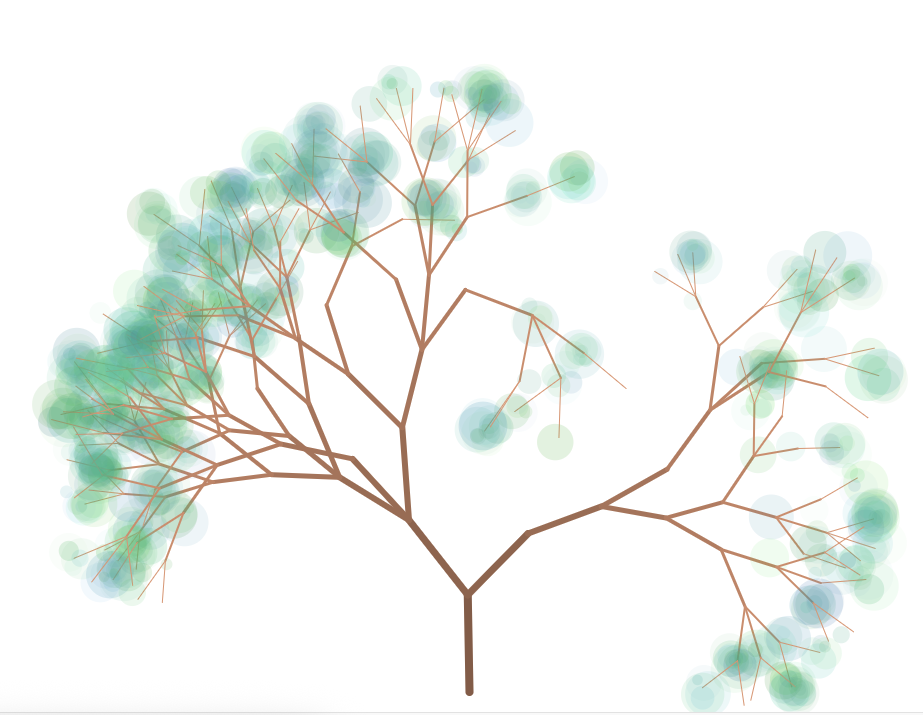
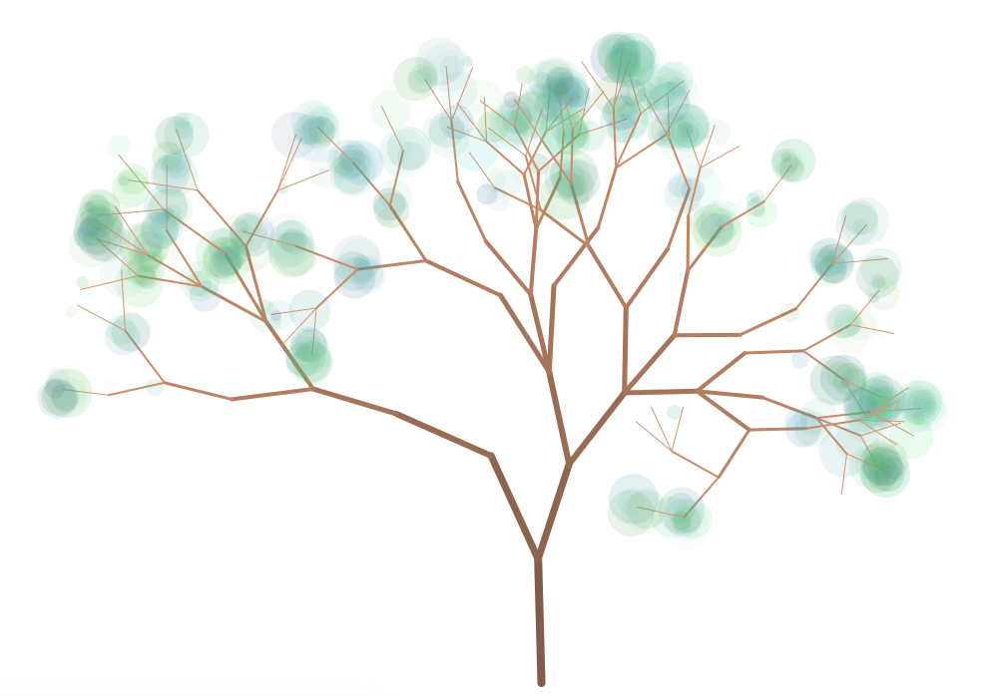
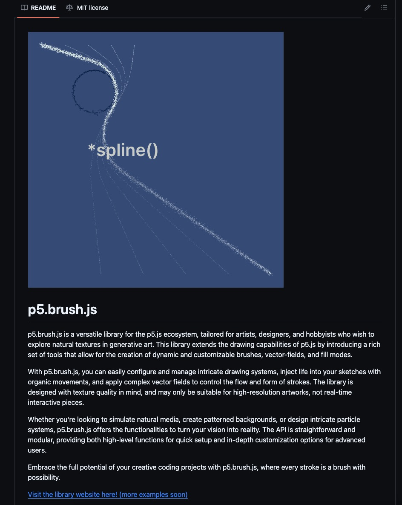
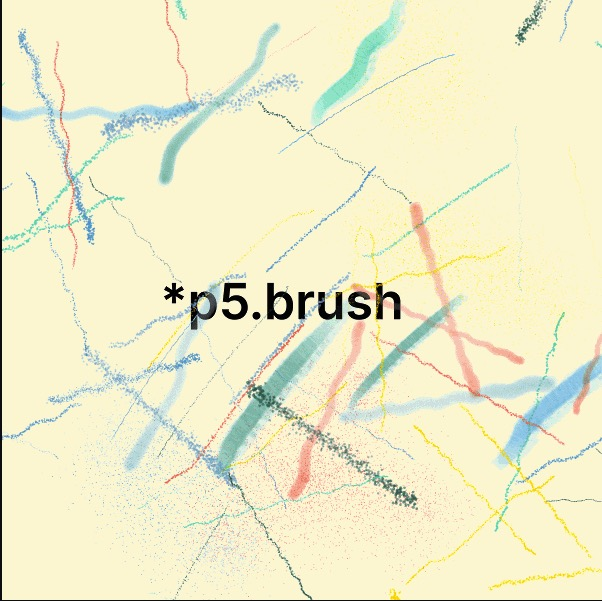

# Quiz 8

## Part 1: Imaging Technique Inspiration

### This interactive tree sketch by Danniwang, built with p5.js, uses transparency and color gradients to simulate layered leaves, creating depth and motion.  Each refresh generates a unique variation, while mouse interaction produces rhythmic visual patterns.  These techniques echo Anwar Jalal Shemza’s Apple Tree, where repeated circular and geometric motifs evoke structured yet organic forms.  The sketch’s generative and rule-based approach aligns with Shemza’s use of abstraction rooted in cultural symbolism.

## Part 2: Coding Technique Exploration

### p5.brush is a painting extension library based on p5.js, which can achieve brush rendering with randomness and pressure-sensing effects. This coding technology helps simulate the flowing brushstrokes and the texture of layered coloring in the pen. Through this technology, I can create an interactive interface that enables users to interact with the scene, thereby enhancing narrative expression and immersion. It is also highly consistent with the organic structural aesthetics of constructing form and meaning through repetition, variation and patterns in "Apple Tree".

[Link p5.brush](https://github.com/acamposuribe/p5.brush)